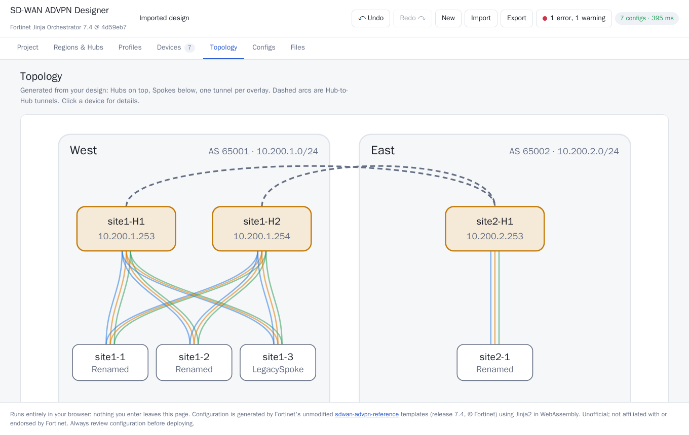
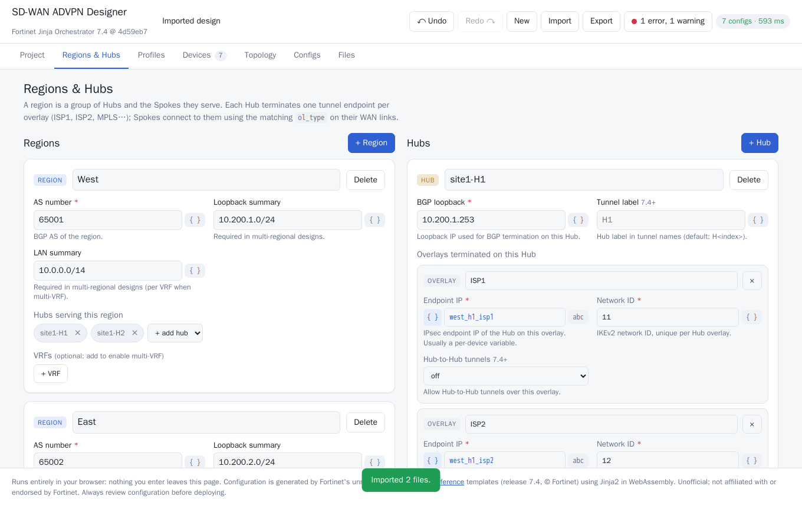
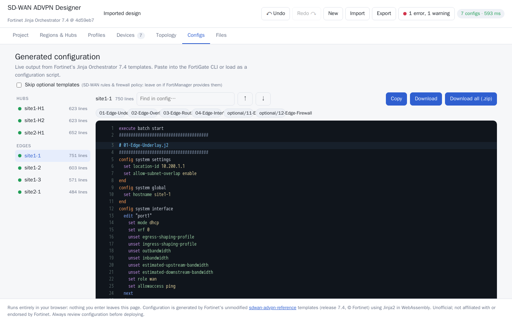

# SD-WAN ADVPN Designer

Design a Fortinet SD-WAN/ADVPN network in a web UI instead of writing Jinja and CLI by hand. The configuration is generated live in your browser.

**Live:** https://sdwan.2haks.xyz  (release **7.4**)



## What it does

[Fortinet's SD-WAN/ADVPN reference](https://github.com/fortinet-solutions-cse/sdwan-advpn-reference) ("Jinja Orchestrator") turns a *Project Template* (regions, hubs, device profiles) plus a device *inventory* into FortiGate CLI. This tool is a visual front end for it:

| Tab | What you do |
|---|---|
| **Project** | Global options (routing design, certificate/PSK auth, multi-VRF, DHCP, zones, stateful enforcement) with Fortinet's defaults shown |
| **Regions & Hubs** | Regions (AS, summaries, VRFs), Hubs (BGP loopback, overlays, peering) |
| **Profiles** | Per-site interface layouts with role-aware forms (WAN, LAN, VLAN, LAG, bridge, FortiLink, FEX, PPPoE...); `{ }` marks per-device variables |
| **Devices** | The inventory as a table: clone rows, add N devices, CSV import/export, defaults |
| **Topology** | Diagram generated from the design |
| **Configs** | Live FortiGate CLI per device (highlighting, search, copy, download, zip) |
| **Files** | The exact `Project.j2` and `inventory.json`, import of existing ones, offline render command |

Import your existing `Project.j2` + `inventory.json` (or one of Fortinet's examples) and edit them visually. Undo/redo and autosave included.




## How it works

Everything runs in the browser; nothing you enter is sent anywhere (the CSP has no external connections).

1. The design model is turned into a real Project Template and inventory.
2. **Fortinet's unmodified 7.4 templates** are rendered by real **Jinja2 running in WebAssembly** ([Pyodide](https://pyodide.org)) in a Web Worker. Nothing is re-implemented in JavaScript, so output is exactly what Fortinet's tool generates and upstream template updates can be dropped in.
3. Existing Project Templates are *evaluated* (not regex-parsed) to load them into the designer; references to per-device variables are tracked.

Only the `ipaddr` filter (Ansible's) is replaced by a small stdlib-based equivalent (`public/py/ipaddr.py`).

### Verified against Fortinet's own renderer

`scripts/make-oracle.sh` runs Fortinet's `render_config.py` (real Ansible `ipaddr`) on their three example projects; `tests/` checks that this app's engine and a full browser session produce **byte-identical** output for all 19 devices, including after a parse -> regenerate round trip.

```
scripts/test.sh            # engine + round-trip regression (docker, node)
scripts/browser-test.sh    # headless Chromium end-to-end, under the production CSP
```

Fortinet's examples are used as-is; the validator flags a real typo in their mixed inventory (device `site1-3` has hostname `site1-2`).

## Repository layout

```
public/                 the static site (served as-is by Caddy)
  js/                   ES modules: schema (field catalog), model (emit/parse), views, worker
  py/                   engine.py (render + parse), ipaddr.py
  releases/7.4/         Fortinet templates (unmodified) + examples + manifest.json
  vendor/pyodide/       self-hosted Pyodide runtime + jinja2/markupsafe wheels (~13 MB)
scripts/                vendor-pyodide.sh, make-manifest.py, make-oracle.sh, test.sh, browser-test.sh
tests/                  regression + e2e, oracle/ = Fortinet renderer output
```

Adding another release (e.g. 7.6): copy its templates to `public/releases/<rel>/templates`, run `scripts/make-manifest.py <rel> <upstream-commit>`, then gate the new fields in `public/js/schema.js`.

## Credit and license

All SD-WAN design logic and templates are **Fortinet's** (Consulting Systems Engineers team), from
[fortinet-solutions-cse/sdwan-advpn-reference](https://github.com/fortinet-solutions-cse/sdwan-advpn-reference), release 7.4 @ `4d59eb7`; the field documentation is based on their wiki.
Their repository does not publish a license file, so the templates are included here unmodified and with attribution for interoperability; they remain Fortinet's. Please review configuration before deploying. This is an unofficial community tool, not affiliated with or endorsed by Fortinet.
